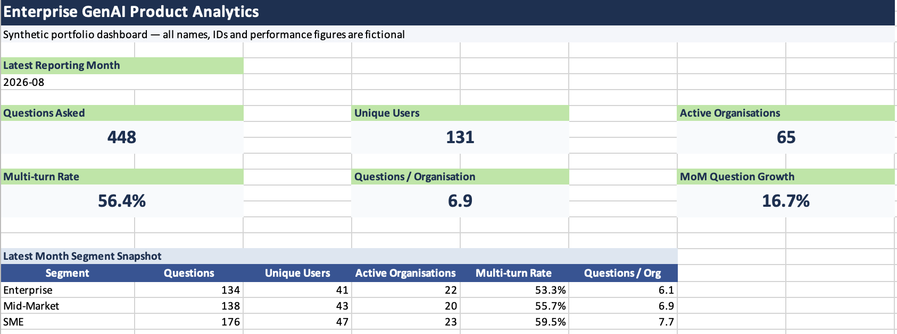

# Enterprise GenAI Product Analytics

A synthetic product analytics project demonstrating how raw interaction data from an enterprise GenAI assistant can be transformed into validated **adoption, engagement and client-level KPIs**.

> **Portfolio note:** All organisations, users, identifiers, timestamps and performance figures in this repository are completely synthetic. No employer or client data is included.

---

## Dashboard Preview



---

## Project Overview

The goal of this project is to demonstrate an end-to-end analytics workflow for measuring usage of an enterprise GenAI assistant.

The project covers:

- Data cleaning and deduplication
- Test and demo account exclusions
- Internal-user exclusions
- KPI definition
- User-level and organisation-level aggregation
- Conversation-thread analysis
- Multi-turn engagement measurement
- Month-on-month growth analysis
- Client segmentation
- Data validation and reconciliation
- Excel dashboard reporting

---

## Business Problem

Measuring AI adoption is not as simple as counting database rows.

Important product questions include:

- How many questions are users asking?
- How many users are actively using the assistant?
- How many client organisations are adopting it?
- Are users continuing conversations after their first question?
- Which client segments demonstrate stronger engagement?
- Is AI usage growing month over month?

Each question requires a different aggregation level and a clearly defined business rule.

---

## Analytics Workflow

```text
Raw Interaction Logs
        ↓
Data Cleaning
        ↓
Valid Analytical Population
        ↓
Core Usage KPIs
        ↓
Conversation Engagement
        ↓
Client Segment Analysis
        ↓
Validation
        ↓
Excel Dashboard
```

---

## Data Model

The synthetic dataset represents four primary entities:

```text
Organisations
     │
     ├── Users
     │
     └── Threads
            │
            └── Messages
```

Different metrics are calculated at different analytical levels:

| Level | Example Metric |
|---|---|
| Message | Questions Asked |
| User | Unique Users |
| Organisation | Active Organisations |
| Thread | Multi-turn Threads |
| Month | MoM Usage Growth |
| Client Segment | Questions per Organisation |

For more detail, see [Data Model](documentation/data_model.md).

---

## Core KPIs

| Metric | Business Purpose |
|---|---|
| Questions Asked | Measures total AI usage volume |
| Unique Users | Measures breadth of user adoption |
| Active Organisations | Measures client-level adoption |
| Threads | Measures AI conversation starts |
| Multi-turn Threads | Measures deeper conversational engagement |
| Multi-turn Rate | Measures conversations continuing beyond one question |
| Questions per Organisation | Measures client-level usage depth |
| Questions per User | Measures user-level usage depth |
| MoM Question Growth | Measures monthly usage growth or decline |

Full definitions are available in the [Metric Dictionary](documentation/metric_dictionary.md).

---

## Data Cleaning

KPIs are not calculated directly from raw event logs.

The analytical population is first cleaned by:

1. Keeping user-question events only
2. Removing test organisations
3. Removing demo organisations
4. Removing internal-user activity
5. Deduplicating message IDs
6. Using stable IDs as aggregation keys

The cleaning SQL is available here:

[01_data_cleaning.sql](sql/01_data_cleaning.sql)

---

## Multi-turn Engagement

One of the key metrics in this project is **multi-turn conversation rate**.

A thread containing only one valid user question is classified as **single-turn**.

A thread containing more than one valid user question is classified as **multi-turn**.

Example:

```text
Thread A

Question 1
    ↓
Assistant Response
    ↓
Question 2
    ↓
Assistant Response

Classification: Multi-turn
```

This provides a simple proxy for conversational depth rather than relying only on raw question volume.

See the SQL implementation:

[03_multi_turn_engagement.sql](sql/03_multi_turn_engagement.sql)

---

## Client Segment Analysis

Synthetic organisations are grouped into:

- Enterprise
- Mid-Market
- SME

The analysis compares segments using:

- Questions asked
- Unique users
- Active organisations
- Conversation threads
- Multi-turn rate
- Questions per organisation

See:

[04_segment_analysis.sql](sql/04_segment_analysis.sql)

---

## Validation

Validation checks include:

- Duplicate message detection
- Internal-user leakage
- Test/demo organisation leakage
- Monthly question reconciliation
- Thread reconciliation
- Multi-turn rate validation
- Organisation-level aggregation checks
- User-level aggregation checks
- MoM calculation checks
- Segment reconciliation
- Timestamp boundary validation

Full details are documented in [Validation Notes](documentation/validation_notes.md).

---

## Project Structure

```text
enterprise-genai-product-analytics/
│
├── data/
│   ├── organisations.csv
│   ├── users.csv
│   ├── threads.csv
│   └── clean_questions.csv
│
├── sql/
│   ├── 01_data_cleaning.sql
│   ├── 02_monthly_usage_metrics.sql
│   ├── 03_multi_turn_engagement.sql
│   └── 04_segment_analysis.sql
│
├── dashboard/
│   └── genai_product_analytics.xlsx
│
├── documentation/
│   ├── metric_dictionary.md
│   ├── data_model.md
│   └── validation_notes.md
│
├── images/
│   └── dashboard_overview.png
│
└── README.md
```

---

## Technologies & Skills Demonstrated

- SQL
- Microsoft Excel
- Product Analytics
- KPI Design
- Data Cleaning
- Data Validation
- Customer Segmentation
- Month-on-Month Analysis
- Relational Data Modelling
- GenAI Product Analytics

---

## Key Learning

A technically correct query does not automatically produce the correct business metric.

The analytical population, aggregation level and KPI definition must be clearly established before reporting.

This project demonstrates the process of moving from:

**Raw product events → clean analytical data → defined KPIs → validated metrics → business insight**

---

## Confidentiality

This repository is a synthetic recreation inspired by professional analytics work.

No employer data, client information, production database schemas, proprietary source code, credentials or confidential performance metrics are included.

All records and analytical results were created solely for portfolio demonstration purposes.
